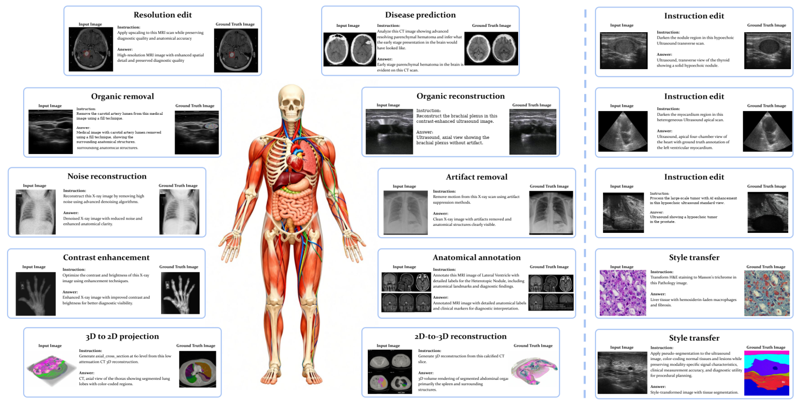
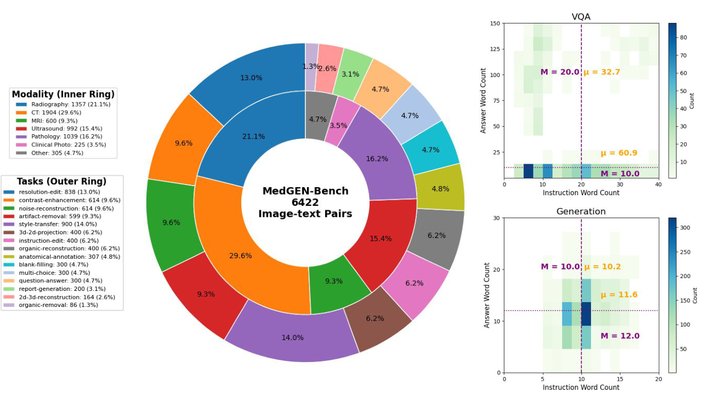
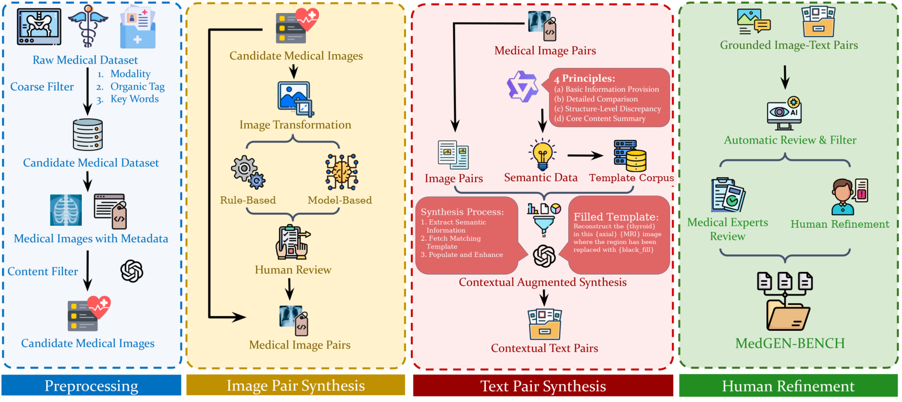

# MedGEN-Bench

> Contextually Entangled Benchmark for Open-Ended Multimodal Medical Generation

[](https://arxiv.org/abs/2511.13135)
[](https://huggingface.co/datasets/Jack04810/MedGEN-Bench)
[](LICENSE)

Official code and evaluation toolkit for MedGEN-Bench.

[Preprint](https://arxiv.org/abs/2511.13135) · [Dataset](https://huggingface.co/datasets/Jack04810/MedGEN-Bench) · [Code](https://github.com/yangjj007/MedGEN-Bench-eval)

## Abstract

As Vision-Language Models (VLMs) increasingly gain traction in medical applications, clinicians are progressively expecting AI systems not only to generate textual diagnoses but also to produce corresponding medical images that integrate seamlessly into authentic clinical workflows. Despite the growing interest, existing medical visual benchmarks present notable limitations. They often rely on ambiguous queries that lack sufficient relevance to image content, oversimplify complex diagnostic reasoning into closed-ended shortcuts, and adopt a text-centric evaluation paradigm that overlooks the importance of image generation capabilities. To address these challenges, we introduce MedGEN-Bench, a comprehensive multimodal benchmark designed to advance medical AI research. MedGEN-Bench comprises 6,422 expert-validated image-text pairs spanning six imaging modalities, 16 clinical tasks, and 28 subtasks. It is structured into three distinct formats: Visual Question Answering, Image Editing, and Contextual Multimodal Generation. What sets MedGEN-Bench apart is its focus on contextually intertwined instructions that necessitate sophisticated cross-modal reasoning and open-ended generative outputs, moving beyond the constraints of multiple-choice formats. To evaluate the performance of existing systems, we employ a novel three-tier assessment framework that integrates pixel-level metrics, semantic text analysis, and expert-guided clinical relevance scoring. Using this framework, we systematically assess 10 compositional frameworks, 3 unified models, and 5 VLMs.

## Benchmark at a glance

<p align="center">
  
</p>
<p align="center"><sub>Figure 2. Representative task cards from the image-editing and multimodal-generation portions of MedGEN-Bench.</sub></p>

<p align="center">
  
</p>
<p align="center"><sub>Figure 3. Dataset statistics and instruction/answer-length distributions in the preprint evaluation snapshot.</sub></p>

<p align="center">
  
</p>
<p align="center"><sub>Figure 4. MedGEN-Bench construction pipeline: preprocessing, image-pair synthesis, text-pair synthesis, and human refinement.</sub></p>

## Setup

```bash
python3.10 -m venv .venv
source .venv/bin/activate
python -m pip install -r requirements.txt
```

## Data

All data, models, caches, outputs, and logs stay inside this repository and
are ignored by Git.

```bash
bash download_medgen_dataset.sh
python prepare_medgen_data.py
bash download_medimageinsight.sh
```

This creates `MedGEN_raw/` for the downloaded source and `MedGEN_data/` for
the prepared data used by inference and evaluation. The download contains the
`image_editing`, `multimodal_generation`, and `vqa` parquet configurations.
The paired dataset is
[Jack04810/MedGEN-Bench](https://huggingface.co/datasets/Jack04810/MedGEN-Bench).
The download script is pinned to the Parquet revision used for this release;
set `MEDGEN_DATASET_REVISION` only when intentionally using another revision.

## Configuration

Use the single root-level `config.yaml`. It contains only public endpoint and
retry defaults. Keep API keys in environment variables.

```bash
export AIHUBMIX_API_KEY='your-key'
```

## External API workflow

The following command runs VQA, image editing, image generation, and their
evaluations through the external API configured in `config.yaml`.

```bash
bash run_external_pipeline.sh
```

Optional model overrides:

```bash
EXTERNAL_VLM_MODEL='qwen3-vl-235b-a22b-instruct' \
EXTERNAL_EDIT_MODEL='gpt-image-1-mini' \
EXTERNAL_GENERATE_MODEL='gpt-image-1-mini' \
bash run_external_pipeline.sh
```

Set `EXTERNAL_USE_VLM_JUDGE=1` to evaluate with an external VLM judge. The
default evaluation uses local metrics only and does not make additional paid
judge requests.

Use `MAX_SAMPLES=1` before a full run to process one item from every task.

## Local model workflow

Download the two local Qwen models into `models/`, then start both local APIs
with one command:

```bash
bash download_local_models.sh
bash start_local_models.sh
```

The Qwen VLM runs through vLLM at `127.0.0.1:8000`. The Qwen Image Edit model
is exposed at `127.0.0.1:8001` with an OpenAI-compatible image endpoint. Run
all local inference and evaluation tasks with:

```bash
bash run_local_pipeline.sh
```

For machines with multiple GPUs, choose devices explicitly:

```bash
LOCAL_VLM_GPU=0 LOCAL_IMAGE_GPU=1 bash start_local_models.sh
```

`LOCAL_IMAGE_CPU_OFFLOAD=sequential` is the default so Qwen Image Edit can run
on a 40 GB GPU. Set `LOCAL_USE_VLM_JUDGE=0` when only local automatic metrics
are needed.

The code license is Apache-2.0. Dataset, model, and external service rights
remain governed by their respective providers.
